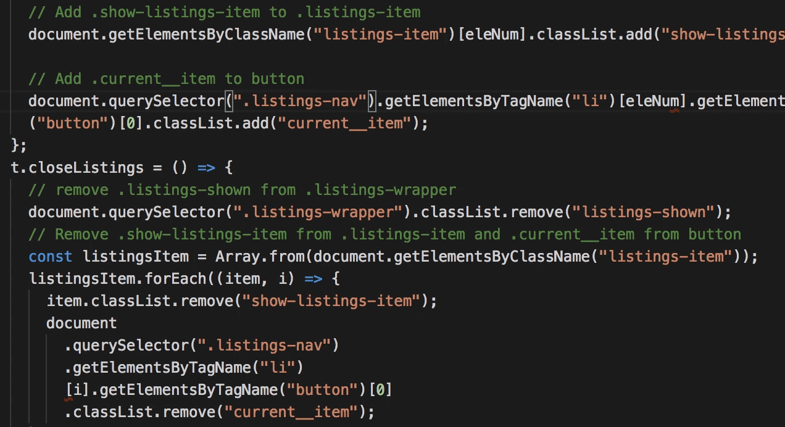

# Codeformatting <!-- omit in toc -->
How to keep your codebase readable and maintainable

## Table of contents <!-- omit in toc -->
- [Why keep one consistent style?](#Why-keep-one-consistent-style)
- [Tools](#Tools)
  - [Why use tools to format my code?](#Why-use-tools-to-format-my-code)
  - [How to incorporate tools into my workflow?](#How-to-incorporate-tools-into-my-workflow)
- [Naming](#Naming)
- [Splitting up your code in modules](#Splitting-up-your-code-in-modules)
- [Conclusion](#Conclusion)
- [Sources](#Sources)

## Why keep one consistent style?

The consistency of a codebase can tell you a great deal about the maintainability of that codebase. 

This is because when a codebase has a good consistency, meaning certain rules are enforced, the reader of that code can make certain assumptions. If variables are always declared at the top of a file, you will know where to look for variables regardless of which file you are looking at.

When working on someone else's code, you ultimately don't want to encounter any surprises, since most surprises lead to time loss. The more reliable and consistent a codebase is, the easier it is to comprehend, navigate through and manipulate existing code.

Apart from other people looking at or working with your code, a consistent coding style also helps you, by avoiding bugs and making navigating through your code easier.

Below I will be describing some ways to make your code as readable and maintainable as possible.

## Tools

### Why use tools to format my code?

Using linters/formatting tools gains you the following advantages:

- You can focus on code, instead of style. When using a tool to format your code you will be able to just write whatever you want and the tool will make sure it is displayed consistently.
- You will write code faster because you don't have to wonder which piece of code looks better, this will be sorted out for you on every save.
- Your codebase will have a consistent style.
- Others can use the same settings, so that you and your team are always working in the same code structure and formatting.

### How to incorporate tools into my workflow?

1. Pick a formatter (I personally use Prettier for Javascript development, but there are loads of different formatters for every language out there).
2. Configure that formatter so that it matches your coding style (e.g. do you want a ```;``` after every line, ```'``` or ```"```).
3. Set up when you want your formatter to run. I personally format every time I save my document, but you could also make an hotkey for this purpose.
4. Start coding, or run the formatter on your already exising codebase.


Example of auto formatting for more readability

## Naming

One important but often overlooked part of code formatting is naming things.

First of all, like with every aspect discussed so far, make sure your naming is consistent. If you use ``` count ``` somewhere and ``` total ``` somewhere else, people could get confused. 

Make sure names are descriptive and, ideally, not too long. Choosing a naming style like ```camelCase``` or ```snake_case``` and sticking with one of those two can greatly improve readability.

Since tools won't help you when naming your variables, it is important that you take care of this issue yourself.

## Splitting up your code in modules

Once you start developing more complex and larger codebases, it can be a good idea to start working with modules.

Different languages have different approaches to working with modules, but I will be looking at it from a Javascript perspective, because that is the language I am most familiar with.

Modules are another way of creating a more maintainable codebase, and help programmers keep an overview of where which functionality is written. 

Since web applications are becoming larger and more complex, it is getting harder to keep all your program logic in one file. 

Files that are too long make it harder to search for specific functionalities and therefore cost more time.

This is where modules come in to play. Modules are a way to separate different parts of your codebase based on functionality.

There are a few other pro's about using modules:

- Simplifying dependency management (only require dependencies for that particular piece of code).
- Code reusability (different modules could be used by multiple programs).
- Circumventing namespace pollution.

## Conclusion

Putting work into formatting your code can seem like a chore, but it will help your workflow in the end.

Setting up your coding style and sticking to it will definitely save you and hopefully other developers a lot of time when working with your codebases.

Consistency and codeformatting isn't the only thing that matters, but it can have a huge impact on your workflow and the maintainability of your code, while it is easy to at least put a little effort into your code quality.

## Sources

- [Why consistency is one of the top indicators of good code](https://medium.com/@jgefroh/why-consistency-is-one-of-the-top-indicators-of-good-code-352ba5d62020)
- [Keep your code clean forever](https://medium.com/@jtomaszewski/keep-your-code-clean-forever-65c71f7f2df)
- [Basics of modular javascript](https://medium.com/@crohacz_86666/basics-of-modular-javascript-2395c82dd93a)